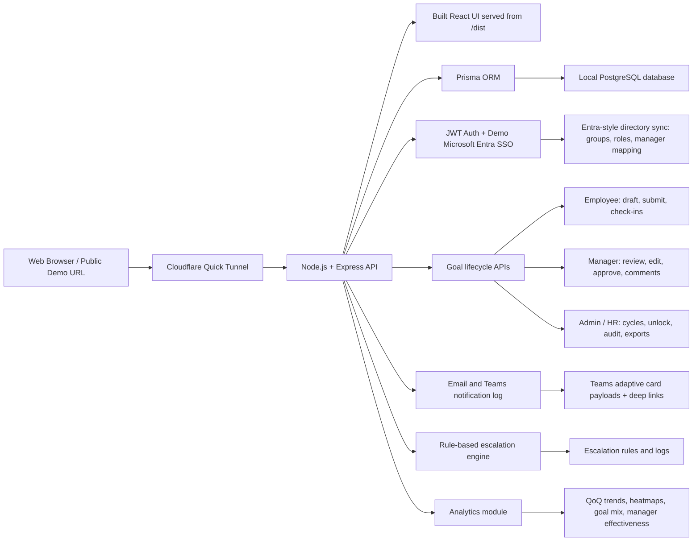

# AtomQuest Goal Portal

AtomQuest Goal Portal is a robust, web-based goal setting and tracking application designed with role-specific journeys for Employees, L1 Managers, and Admin / HR. It provides a seamless experience for creating, approving, and tracking professional goals throughout their lifecycle.

## Links
* **Live Demo:** [https://tail-omissions-pension-lot.trycloudflare.com](https://tail-omissions-pension-lot.trycloudflare.com)
* **Source Code:** [https://github.com/coder200412/Atomquet](https://github.com/coder200412/Atomquet)
* **BRD Alignment:** [docs/brd_alignment.md](docs/brd_alignment.md)

## Features
* **Role-based Workflows:** Distinct views and permissions for Employees, Managers, and Admins.
* **Goal Lifecycle Management:** Support for drafting, submitting, reviewing, approving, and completing goals.
* **Simulated SSO:** Microsoft Entra-style SSO and directory sync simulation.
* **Extensible Notification & Escalation:** Built-in module for email and Teams notifications along with a rule-based escalation engine.
* **Analytics Dashboard:** Visualise data including QoQ trends, heatmaps, goal mix, and manager effectiveness.
* **Public Signup:** Hackathon visitors can create an Employee or Manager account and sign back in with their email and password.

## Architecture

The project operates as a single Node.js service that serves both the built React frontend and the Express API, backed by a local PostgreSQL database using Prisma ORM.



## Tech Stack
* **Frontend:** React + Vite, Recharts, Lucide Icons
* **Backend:** Node.js + Express
* **Database:** PostgreSQL (Local)
* **ORM:** Prisma
* **Authentication:** JWT with simulated SSO

## Getting Started

1. **Install dependencies:**
   ```bash
   npm install
   ```

2. **Initialize Database:**
   Ensure PostgreSQL is running, then set up the schema and seed data:
   ```bash
   npm run db:reset
   ```

3. **Start Development Server:**
   ```bash
   npm run dev
   ```

4. **Build for Production:**
   ```bash
   npm run build
   ```

5. **Start Production Server:**
   ```bash
   npm run start
   ```

## Render Deployment

Use a Render Web Service with Render Postgres.

```bash
# Build command
npm install && npx prisma generate && npm run build

# Start command
npm run db:deploy && npm run start
```

`npm run db:deploy` applies the Prisma schema and seeds demo users only when the database is empty, so newly created hackathon accounts are preserved.
