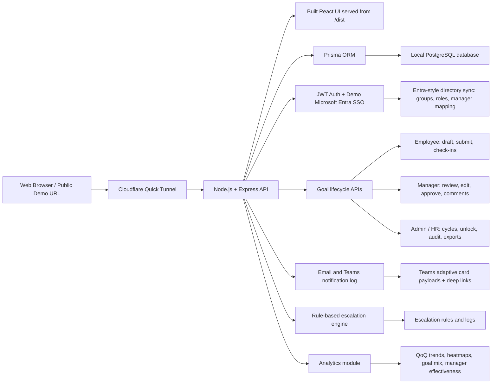

# AtomQuest Goal Portal Architecture

## Overview

AtomQuest Goal Portal is a browser-based goal setting and tracking application with role-specific journeys for Employees, L1 Managers, and Admin / HR. The production demo runs as a single Node.js service that serves the React frontend and Express API, backed by local PostgreSQL through Prisma ORM.

## Architecture Diagram

## Technology Choices

- Frontend: React + Vite with Recharts and Lucide icons.
- Backend: Node.js + Express.
- Database: Local PostgreSQL, accessed through Prisma.
- Authentication: JWT email/password demo auth plus Microsoft Entra-style SSO simulation.
- Hosting: Local Node server exposed through a Cloudflare public tunnel for hackathon demo access.

## Cost Optimisation Notes

- Single deployable Node service serves both static UI and API.
- Local PostgreSQL avoids paid database infrastructure for the demo.
- Prisma keeps data access typed and efficient.
- Analytics are computed from existing relational data without external services.
- Email, Teams, Entra, and escalation integrations are represented as demo-ready modules without paid API calls.
