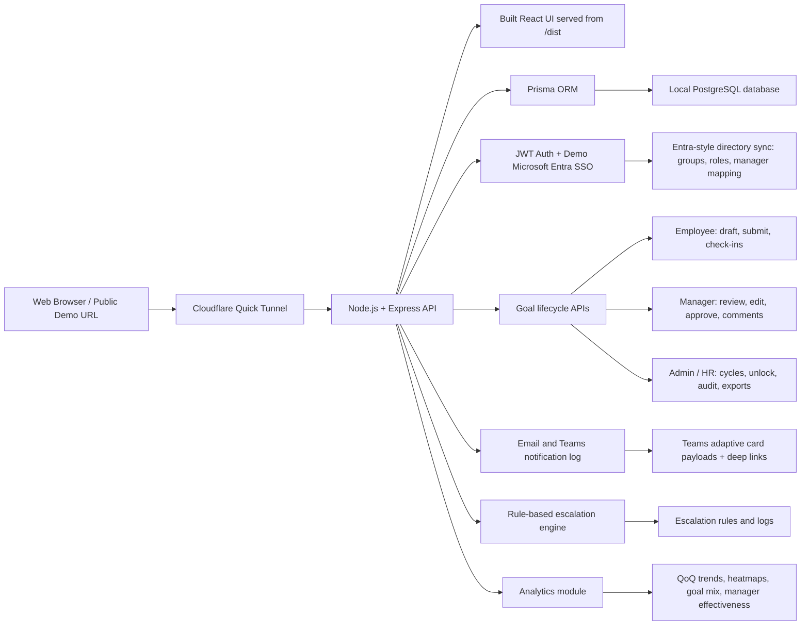

# AtomQuest Goal Portal - Submission

## Working Link
[https://3b9b120e655398.lhr.life](https://3b9b120e655398.lhr.life)

## Source Code Repository
[https://github.com/coder200412/Atomquet](https://github.com/coder200412/Atomquet)

## Architecture Diagram

