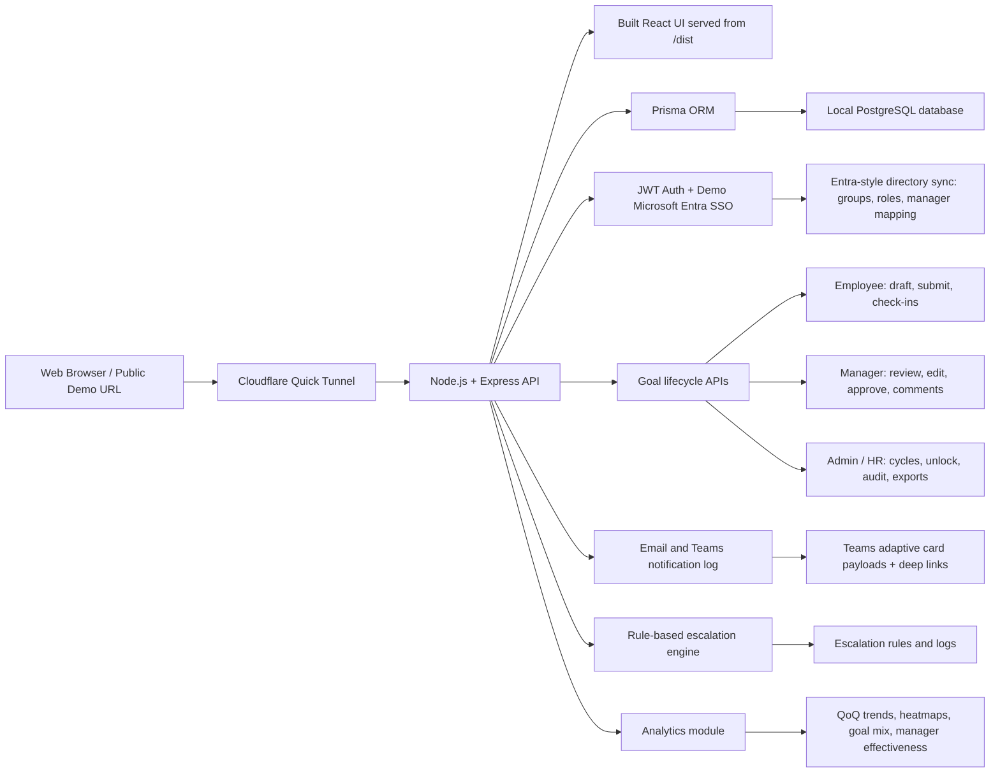

# AtomQuest Goal Portal - Submission

## Working Link
[https://tail-omissions-pension-lot.trycloudflare.com](https://tail-omissions-pension-lot.trycloudflare.com)

## Source Code Repository
[https://github.com/coder200412/Atomquet](https://github.com/coder200412/Atomquet)

## BRD Alignment
[docs/brd_alignment.md](docs/brd_alignment.md)

## Demo Login Credentials
All seeded demo accounts use `password123`.

| Role | Email |
| --- | --- |
| Admin / HR | `admin@atomquest.local` |
| Manager | `maya.manager@atomquest.local` |
| Manager | `karan.manager@atomquest.local` |
| Employee | `neha.employee@atomquest.local` |
| Employee | `arjun.employee@atomquest.local` |
| Employee | `diya.employee@atomquest.local` |

Visitors can also create a new Employee or Manager account from the login screen.

## Architecture Diagram

